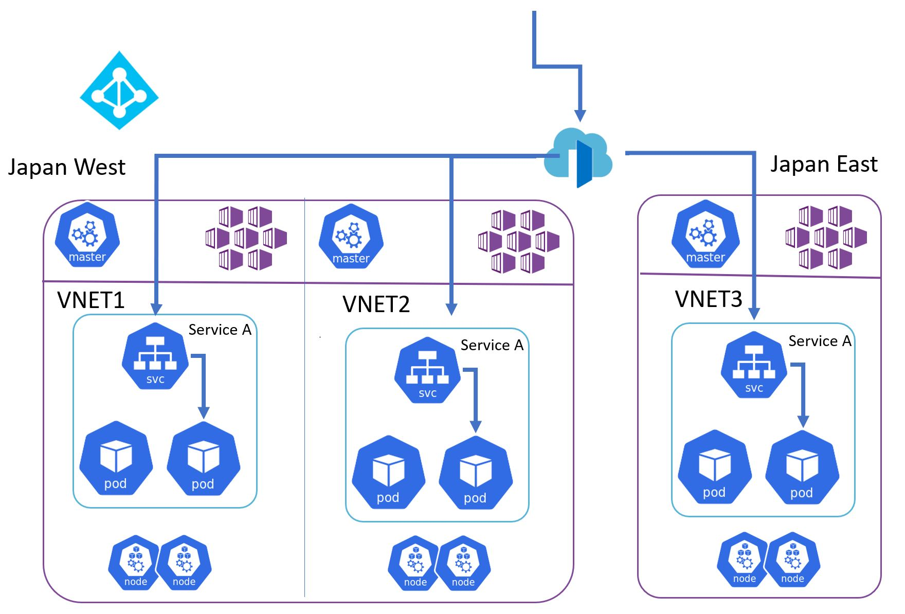

# tf-aks-frontdoor-cluster

## Resource Overview




* Cluster Group
  * Service Principal (for AKS Cluster)
    * Role Assignment
    * Password
  * AKS Cluster * 3 (Active/Active/Active)
  * Kubernetes Resources
    * Nginx
  * Azure Front Door

## Directories and Shell scripts

```
.  
├── cluster
│   ├── cleanup.sh (Delete all Azure resouces)
│   ├── deploy.sh (Deploy clusters)
│   └── prep.sh  (Set environment variables and create remote data store for Terraform state)
└── module
│   └── cluster (AKS and Active Directory Resouces HCL)
└── test (test script)

```


## Preparation

Open prep.sh and modify following values
```
# Please Specify Resouce Identifier (ex. daisuke)
export TF_VAR_rp_prefix="YourResouceIdentifier"

# 1st region
export TF_VAR_rp_resource_group_location_1="japanwest"

# 2nd region
export TF_VAR_rp_resource_group_location_2="japaneast"

# 3nd region
export TF_VAR_rp_resource_group_location_3="japanwest"
```

Create a storage account to store the Terraform State. 
Don't forget "source" to put the key in an environment variable.

```
source ./prep.sh
```

__The Terraform and bash scripts in this sample use environment variables. If the session is interrupted / broken in the following steps, re-execute the above script__


## Creating clusters

```
./deploy.sh
```

The clusters are now created. To operate the clusters, obtain a credential for each cluster each time.

[Azure CLI - az aks get-credentials](https://docs.microsoft.com/en-us/cli/azure/aks?view=azure-cli-latest#az-aks-get-credentials)

```
az aks get-credentials -g YOUR-RESOURCE-GROUP -n YOUR-CLUSTER -a -f
```


## Delete Resources


```
./cleanup.sh
```